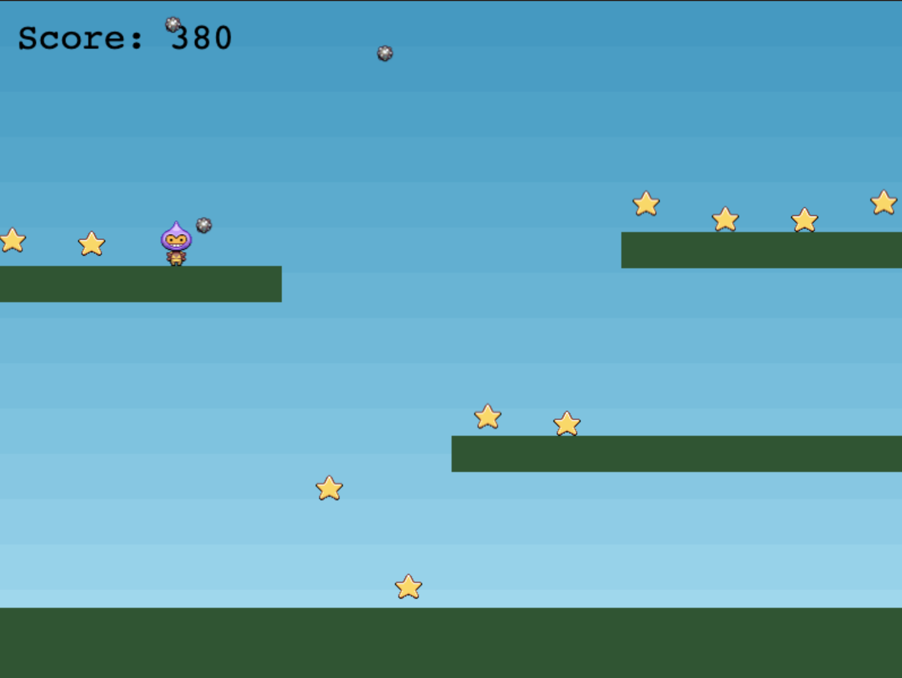

# Phaser Webpack Init Repo

Getting Started tutorial from [phaser.io](http://phaser.io/tutorials/making-your-first-phaser-3-game/part1)



# Project Details

This project includes my code practice for a working game built following the 'Getting started tutorial' from [phaser.io](http://phaser.io/tutorials/making-your-first-phaser-3-game/part1)

# Live demo

[Raw Githack link](https://raw.githack.com/canriquez/phaser-tutorial/feat_init/build/index.html)
 
Includes basic configuration for 
- WebPack basic config(CSS/icons)
- JS/HTML/CSS 
- Phaser
- Basic source fonts: open source Futura (./src/fonts/futura)

## Built With

- HTML/CSS, Javascript, Webpack, NPM, yarn.
- ESlint, Stylelint
- Phaser
- VSCode


## Getting Started


To get a local copy up and running, follow these simple example steps.

### Prerequisites
- To install the app in your system, make sure you have node/npm installed. [get npm](https://www.npmjs.com/get-npm)

### Setup
- Clone the repository in your system by using: 

``` git clone  ```

### Install
- Next step is to CD into the local repository and run:

``` $ npm install ```
``` $ yarn build ```


## Author

👤 ***Carlos Anriquez***

- Github: [@canriquez](https://github.com/canriquez)
- Twitter: [@cranriquez](https://twitter.com/cranriquez)
- Linkedin: [linkedin](https://www.linkedin.com/in/carlosanriquez/)
- Portfolio: [carlosanriquez.com](https://www.carlosanriquez.com)

## 🤝 Contributing

Contributions, issues, and feature requests are welcome!

Feel free to check the [issues page](issues/).

## Show your support

Give a ⭐️ if you like this project!

## Acknowledgments

- [phaser.io](http://phaser.io/tutorials/making-your-first-phaser-3-game/part1)

## 📝 License

This project is [MIT](./LICENSE) licensed.
